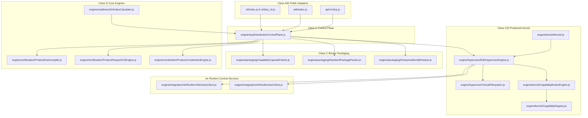

/******************************************************************************
 * Project        : Enterprise Autonomous Operational Readiness & Certification System (EAORCS)
 * Module         : Architecture & Subsystem Dependency Graph
 * File           : DEPENDENCY_GRAPH.md
 * Version        : 2026.2-LTS (v1.1.0-FROZEN Master Specification)
 * Author         : Architectural Governance Council & Ujomor Systems Engineering
 * Organization   : Air Roofers Platform Ecosystem & Ujomor Systems
 * Created Date   : 2026-08-02
 * Last Modified  : 2026-08-02
 * Classification : GOVERNMENT | ENTERPRISE | RESTRICTED
 *
 * Governance:
 * - Architecture Authority Approved & FROZEN (v1.1.0-FROZEN)
 * - Security Reviewed (ISO 27001, SOC 2, OWASP ASVS, NIST SP 800-161, DORA, NIS2, EU AI Act)
 * - Universal Autonomous Engineering Governance Operating System (UAIGOS 3.0.0) Compliant
 *
 * Standards:
 * - ISO 27001 / SOC 2 / OWASP ASVS / NIST SP 800-161 / SLSA Level 4
 *
 * Copyright (c) 2026 Air Roofers Platform Ecosystem & Ujomor Systems
 * All Rights Reserved.
 ******************************************************************************/

# EAORCS Architecture & Subsystem Dependency Graph (v2026.2-LTS)

## 1. System Topological Overview

The following diagram illustrates the unidirectional dependency graph across all EAORCS subsystems:

---

## 2. Invariant Rules for Dependency Graph
1. **Unidirectional Flow**: Public Adapters -> Control Plane -> Core Kernel & Hypervisor -> Sealed Engines.
2. **Zero Circular Dependencies**: Lower-level modules MUST NOT import higher-level CLI or REST route modules.
3. **VFS Encapsulation**: File access inside EDH MUST pass through `VirtualFilesystem.js`. Direct un-sandboxed host disk access is strictly prohibited.

*Dependency Graph Document Certified by Architectural Governance Council.*
