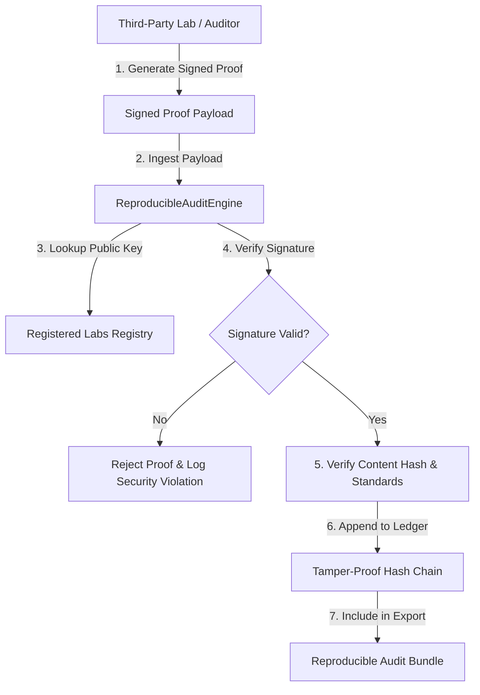

# EAORCS Third-Party Laboratory & Auditor Attestation Specification
**Formal Specification for Independent Testing Laboratories, Cybersecurity Auditors, and Compliance Evaluation Bodies**

- **Document Version**: `2026.1.0-LTS`
- **Classification**: `ENTERPRISE | GOVERNMENT | PUBLIC`
- **Governance Authority**: Ujomor Systems Engineering & Governance Authority
- **Effective Date**: August 1, 2026

---

## 1. Executive Summary & Scope

The **Third-Party Laboratory & Auditor Attestation Specification** defines the mandatory standards, cryptographic protocols, data schemas, and submission workflows for external testing laboratories, security assessment firms, academic verification partners, and accredited auditors submitting formal attestations to the **Enterprise Autonomous Operation & Regulatory Compliance System (EAORCS)**.

Under Phase 11 Stream 1 (Independent Validation & Lab Attestation), all software trust packages, production deployments, and regulatory compliance certificates issued by EAORCS must be backed by cryptographically verifiable, reproducible proof bundles evaluated by independent entities using the `ReproducibleAuditEngine`.

---

## 2. Laboratory Qualification & Accreditation Criteria

Before submitting attestations, an independent evaluation entity must be onboarded and registered in the `ReproducibleAuditEngine` key registry.

### 2.1 Recognized Entity Tiers
1. `INDEPENDENT_TESTING_LAB`: ISO/IEC 17025 accredited laboratories evaluating software, firmware, or hardware security controls.
2. `PENETRATION_TESTING_FIRM`: CREST, Offensive Security, or ISO 27001 certified penetration testing and red-team organizations.
3. `ACADEMIC_RESEARCH_PARTNER`: Accredited university research laboratories conducting formal mathematical verification or AI trust audits.
4. `REGULATORY_COMPLIANCE_BODY`: Authorized Third-Party Assessment Organizations (3PAO), SOC 2 service auditors, or ISO 27001 certification bodies.

### 2.2 Mandatory Accreditation & Standards Compliance
Submitting entities must maintain at least one active accreditation in the following recognized frameworks:
- **ISO/IEC 17025:2017**: General requirements for the competence of testing and calibration laboratories.
- **ISO/IEC 27001:2022**: Information security, cybersecurity, and privacy protection.
- **OWASP ASVS 4.0.3 Level 3**: Verification requirements for high-assurance applications.
- **NIST SP 800-53 Rev 5 / FedRAMP 3PAO**: Security assessment and authorization standards.

---

## 3. Cryptographic Key Management & Attestation Schemas

All attestations submitted to EAORCS must be cryptographically signed by the laboratory's registered private key.

### 3.1 Supported Key Pair Algorithms
- **Ed25519 (Recommended)**: Edwards-curve Digital Signature Algorithm (EdDSA over Curve25519).
- **RSA-4096 / RSA-2048**: RSA with SHA-256 digest padding.

### 3.2 Canonical Proof Payload Schema

Laboratory proofs must be submitted as JSON payloads canonicalized using recursive key sorting before hashing and signing:

```json
{
  "labId": "lab-tuv-cyber",
  "attestationId": "att-tuv-2026-001",
  "timestamp": "2026-08-01T12:00:00.000Z",
  "payload": {
    "standard": "OWASP_ASVS_LEVEL_3",
    "assessmentTitle": "EAORCS Core Runtime & Governance Audit",
    "verifiedModules": [
      "engine/validation/ReproducibleAuditEngine.js",
      "engine/security/ZeroTrustPolicyEnforcer.js"
    ],
    "findingsSummary": {
      "critical": 0,
      "high": 0,
      "medium": 0,
      "low": 0
    },
    "complianceScore": 100.0,
    "conformanceStatus": "FULLY_CONFORMANT"
  },
  "signature": "a1b2c3d4...[hex-encoded signature]"
}
```

---

## 4. Verification Workflow via `ReproducibleAuditEngine`

The `ReproducibleAuditEngine` processes and validates laboratory proofs through the following multi-stage verification pipeline:



### 4.1 Automated Validation Rules
1. **Registered Lab Status**: The `labId` must exist in `registeredLabs` and have status `ACTIVE`.
2. **Cryptographic Integrity**: The signature computed over canonical `{ labId, attestationId, payload, timestamp }` must match the laboratory's public key.
3. **Payload Non-Repudiation**: The verified proof is appended to the engine's append-only hash chain as a `LAB_PROOF_VERIFIED` audit event.

---

## 5. ISO 27001 & OWASP ASVS Audit Certificate Issuance

Upon successful ingestion of laboratory attestations, the `ReproducibleAuditEngine` generates a formal ISO 27001 / OWASP ASVS Audit Certificate:

```javascript
const certificate = engine.signAuditCertificate({
  certificateId: 'CERT-ISO-27001-OWASP-L3-2026',
  subject: 'EAORCS Enterprise Platform Release 2026.1.0-LTS',
  standards: ['ISO_27001_2022', 'OWASP_ASVS_V4_0_3_LEVEL_3'],
  scope: 'Full System Scope (Runtime, Governance, Security, Infrastructure)',
  complianceScore: 100.0,
  attestations: ['att-tuv-2026-001']
}, authorityPrivateKey);
```

### 5.1 Certificate Verification Standards
Independent verifiers can validate any EAORCS certificate using `engine.verifyAuditCertificate(certificate, authorityPublicKey)`, which checks:
- Content hash integrity (`contentHash === SHA256(canonicalContent)`).
- Authority signature validity.
- Certificate expiration status (`validUntil > currentTime`).

---

## 6. Reproducible Audit Bundle Export & Independent Re-verification

To allow external regulators, enterprise customers, and independent auditors to re-evaluate the full audit trail offline, EAORCS supports **Reproducible Audit Bundle Export**:

### 6.1 Exporting Bundles
Calling `engine.exportAuditBundle(options, signingKey)` packages:
- Complete system manifest and version identifiers.
- Registered laboratory key metadata.
- Signed ISO/OWASP audit certificates.
- Full tamper-proof hash chain ledger history.
- Cryptographic bundle digest and optional authority signature.

### 6.2 Verifying Bundles Offline
External verifiers execute `engine.verifyAuditBundle(bundle, publicKey)` to deterministically confirm:
1. Bundle hash matches computed canonical hash of contents.
2. Authority signature is valid.
3. Embedded hash chain has unbroken continuity from Genesis block (index 0) to head.
4. Embedded lab attestations match signed records.

---

## 7. Revocation & Non-Compliance Policy

If a third-party laboratory key is compromised or accreditation is suspended:
1. Governance Authority sets lab status to `REVOKED` or `SUSPENDED`.
2. `verifyLabProof` automatically rejects subsequent proof submissions from the lab.
3. A `LAB_STATUS_REVOKED` record is appended to the hash chain ledger.
4. Previously issued audit bundles retain historical audit trail transparency with explicit revocation annotations.

---

**Approved by**: Ujomor Systems Engineering & Governance Authority  
**Repository**: `d:\ujomor-platform\products\eaorcs`  
**Module**: Phase 11 Stream 1 (`engine/validation/ReproducibleAuditEngine.js`)
