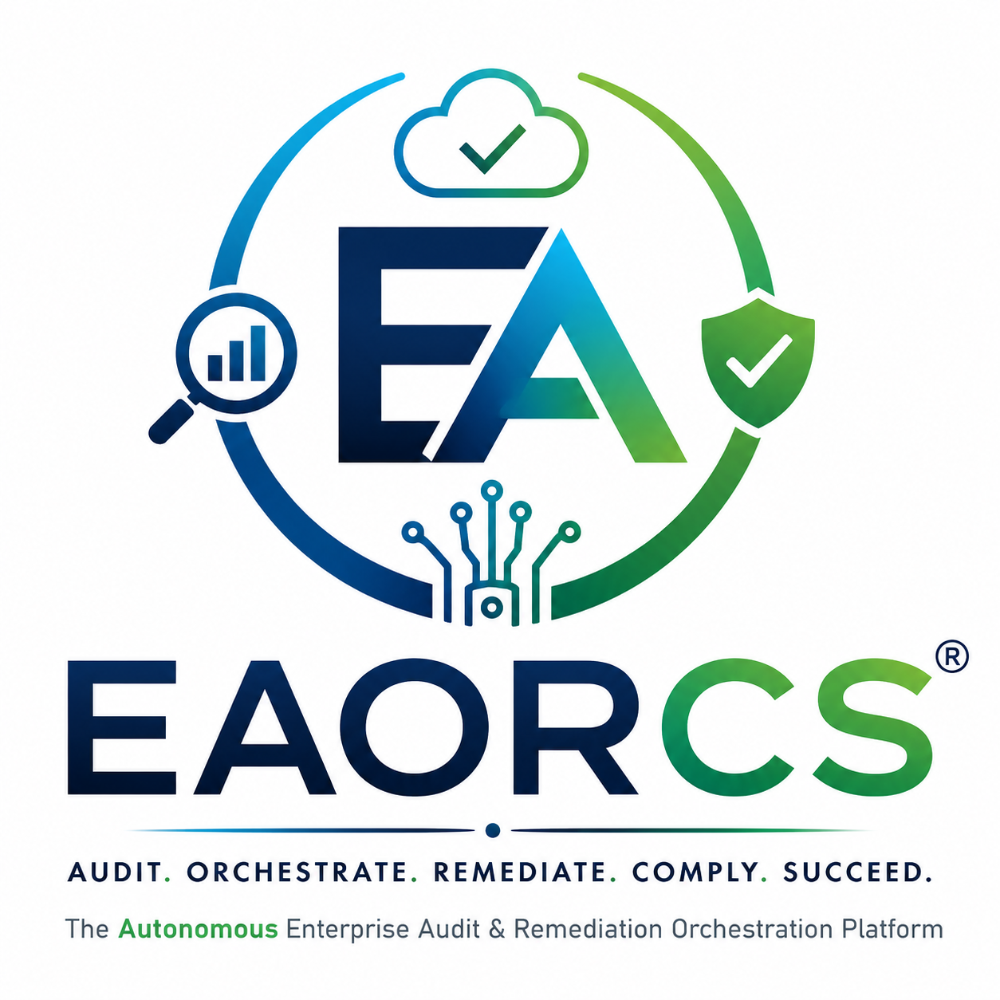

# CLI Grammar Specification



**Standard**: Universal Autonomous AI Governance Operating System (UAIGOS 3.0.0)  
**Authority**: Ujomor Systems Engineering & Governance Authority  
**Organization**: Ujomor Systems & Enterprise Governance  
**Classification**: GOVERNMENT | ENTERPRISE | RESTRICTED  

---

This document provides a detailed specification of the full Command Line Interface (CLI) grammar tree, global flags, environment variable overrides, and exit status definitions for the Enterprise Autonomous Observability & Regulatory Compliance System (EAORCS).

## 1. Global CLI Grammar Tree

The EAORCS CLI is structured as a hierarchical grammar tree. The root execution context is defined by the Node.js binaries located in the `bin/` directory.

### 1.1 Root Executables

```text
bin/
├── eaorcs.js                     -> Core orchestration and runtime engine
├── eaorcs_installer.js           -> System provisioning and diagnostics
├── ga_readiness_certification.js -> Enterprise test suite validation
├── generate_audit_report.js      -> Markdown audit report generation
└── create_eaorcs_package.js      -> Release procurement packaging
```

### 1.2 Subcommand Hierarchy

#### `eaorcs.js`
- `start`: Initiates runtime services.
- `status`: Queries runtime state.
- `stop`: Terminates runtime services.

#### `eaorcs_installer.js`
- `install`: Provisions required storage directories.
- `doctor`: Performs prerequisite diagnostic checks.

#### (Standalone Executables)
- `ga_readiness_certification.js`: No subcommands, execution triggers pipeline.
- `generate_audit_report.js`: No subcommands, execution triggers report builder.
- `create_eaorcs_package.js`: No subcommands, execution triggers zip packaging.

---

## 2. Global Flags

Global flags apply across all primary CLI binaries, providing standardized behavior for configuration, output formatting, and verbosity.

| Flag | Short | Purpose | Target Grammar Type |
| :--- | :--- | :--- | :--- |
| `--config` | `-c` | Specifies the absolute or relative path to the YAML configuration file. | Filepath (String) |
| `--verbose` | `-v` | Enables detailed debug logging and trace outputs. | Boolean |
| `--quiet` | `-q` | Suppresses standard output, retaining only error-level logs. | Boolean |
| `--format` | `-f` | Defines standard output format (e.g., `text`, `json`, `yaml`). | String Enum |
| `--output` | `-o` | Designates the target destination directory or file for generated artifacts. | Path (String) |

---

## 3. Environment Variable Overrides

Environment variables provide an alternative, precedence-based mechanism to override CLI flags. This ensures container-native and CI/CD-friendly execution.

| Environment Variable | Equivalent Flag | Description |
| :--- | :--- | :--- |
| `EAORCS_CONFIG` | `--config` | Path to the system configuration file (`eaorcs.config.yaml`). |
| `EAORCS_LOG_LEVEL` | `--verbose` / `--quiet` | Defines logging verbosity. Accepted values: `debug`, `info`, `warn`, `error`. |
| `EAORCS_AUDIT_MODE` | `--mode` | Dictates strictness of the audit generation (e.g., `standard`, `strict`). |
| `EAORCS_TEST_SUITE` | `--suite` | Specifies which GA certification test suite to run. |
| `EAORCS_SIGN_PACKAGE` | `--sign` | If set to `true`, enforces cryptographic signing on release packages. |
| `EAORCS_AUDIT_OUT` | `--output` | Specifies the destination path for audit reports. |

---

## 4. Exit Status Definitions

The EAORCS CLI strictly adheres to a deterministic, 3-tier exit code architecture. This ensures that CI/CD pipelines can differentiate between operational failures and governance/compliance violations.

### `0` - Success (SUCCESS)
- **Definition**: The command executed successfully, fulfilling its primary operational intent.
- **Conditions**: All tests passed, reports generated, engine started/stopped correctly.
- **Pipeline Action**: Proceed to the next execution step.

### `1` - Error (FATAL_ERROR)
- **Definition**: A systemic, syntactical, or runtime error occurred preventing execution.
- **Conditions**: Missing files, syntax errors, read/write permission denial, or OS incompatibility.
- **Pipeline Action**: Halt pipeline, page system administrator.

### `2` - Governance Gate Violation (GOVERNANCE_VIOLATION)
- **Definition**: The command executed successfully from a runtime perspective, but the outcome violated a strict governance, security, or compliance policy.
- **Conditions**: GA certification suite failure (e.g., `14/15 PASS`), missing brand assets, missing Ed25519 signatures, or failure to meet SLSA Level 4 criteria.
- **Pipeline Action**: Halt pipeline, escalate to the Compliance & Security Officer, trigger audit review.
