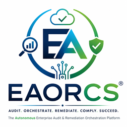

/******************************************************************************
 * Project        : EAORCS Continuous Software Assurance Platform
 * Module         : Developer Guide
 * File           : DEVELOPER_GUIDE.md
 * Version        : 2026.1-LTS
 * Author         : Architectural Governance Council & Ujomor Systems Engineering
 * Organization   : Ujomor Systems Ecosystem
 * Created Date   : 2026-08-01
 * Last Modified  : 2026-08-01
 * Classification : ENTERPRISE | PUBLIC RELEASE
 *
 * Governance:
 * - Security Reviewed
 * - Architecture Controlled
 * - Protocol Frozen
 * - Modularization Enforced
 *
 * Standards:
 * - ISO 27001
 * - OWASP ASVS 4.0
 * - ISO/IEC 25010
 * - Clean Code Architecture
 *
 * Copyright (c) 2026 Ujomor Systems Ecosystem. All Rights Reserved.
 ******************************************************************************/


<p align="center">
  
</p>

# EAORCS Developer Guide
**Version 2026.1.0-GA** | **Ujomor Systems Ecosystem**

---

## Table of Contents
1. [Developer Architecture Overview](#1-developer-architecture-overview)
2. [Development Environment Setup](#2-development-environment-setup)
3. [Repository & Directory Layout](#3-repository--directory-layout)
4. [UTCF Plugin & Adapter Development Framework](#4-utcf-plugin--adapter-development-framework)
5. [Custom Capability Streams Implementation](#5-custom-capability-streams-implementation)
6. [Contract Validation & JSON Schema Engine](#6-contract-validation--json-schema-engine)
7. [CLI Subcommand Extension](#7-cli-subcommand-extension)
8. [Testing, QA & Certification Suite](#8-testing-qa--certification-suite)
9. [Contribution & Architectural Governance Workflow](#9-contribution--architectural-governance-workflow)

---

## 1. Developer Architecture Overview

EAORCS is architected around strict domain isolation and bounded contexts across 9 architectural layers.

```
+--------------------------------------------------------------------+
| Layer 9: Presentation & Reporting (Web Console / PDF / Dashboards)  |
| Layer 8: Remediation Engine (Automated Actions / CI-CD Enforcement) |
| Layer 7: OSAP Certification & Passport Generator                   |
| Layer 6: Audit Execution & Compliance Matrix Compiler              |
| Layer 5: Evidence Store & Cryptographic Verifier (Ed25519)          |
| Layer 4: Telemetry Aggregation & Event Processing                  |
| Layer 3: UTCF Domain Adapters (20 Technology Layers)                |
| Layer 2: DSL Engine & Contract Policy Compiler                     |
| Layer 1: Core Runtime Abstractions (Storage, Cache, Queue, Host)   |
+--------------------------------------------------------------------+
```

---

## 2. Development Environment Setup

### Prerequisites
- **Node.js**: `v18.16.0` LTS or later
- **npm**: `v9.0.0` or later
- **Git**: `v2.40.0` or later

### Installation & Bootstrap
```bash
# Clone the repository
git clone https://github.com/ujomor-platform/eaorcs.git
cd eaorcs

# Install dependencies
npm install

# Run internal certification check
node certify.js

# Execute unit test suite
npm test
```

---

## 3. Repository & Directory Layout

```txt
eaorcs/
├── .github/                 # CI/CD Workflows
├── .governance/             # Governed Contracts, ADRs, State & Compression
├── adapters/                # UTCF Adapter Plugins & Registry
│   └── utcf_registry.json   # UTCF Layer Adapter Definitions
├── api/                     # REST, GraphQL, and AsyncAPI Routes
├── audits/                  # Audit execution logs & historical reports
├── bin/                     # Executable CLI entrypoints (eaorcs, eaorcs.ps1)
├── cli/                     # CLI Subcommand Implementations
├── config/                  # Core runtime configuration files
├── domains/                 # 7 Capability Domain Business Logic
├── dsl/                     # Domain Specific Language Compiler & Lexer
├── engine/                  # Continuous Compliance & Evidence Engine
├── evidence/                # Cryptographic evidence verification engine
├── packaging/               # Helm, Docker, and OSAP packaging tools
├── schemas/                 # JSON Schemas & OpenAPI Spec Definitions
├── sdk/                     # Official `@eaorcs/sdk` Package Source
├── storage/                 # Data, Cache, and State Persistence Abstractions
└── tests/                   # Unit, Integration, and Contract Tests
```

---

## 4. UTCF Plugin & Adapter Development Framework

The **Universal Technology Coverage Framework (UTCF)** enables developers to extend EAORCS to support custom databases, cloud services, build tools, or proprietary security tools across 20 coverage layers.

### 1. Registering a Custom Adapter
Add your adapter metadata to `adapters/utcf_registry.json`:

```json
{
  "layer_id": "UTC_LAYER_15_CUSTOM_SECOPS",
  "name": "Custom SecOps Vulnerability Adapter",
  "version": "1.0.0",
  "entry_point": "adapters/custom_secops_adapter.js",
  "capabilities": ["vulnerability_scan", "evidence_collection"],
  "enabled": true
}
```

### 2. Implementing the Adapter Class
All UTCF adapters must implement the standard `IUTCFAdapter` interface:

```javascript
/**
 * Custom SecOps UTCF Adapter
 * Layer: UTC_LAYER_15_CUSTOM_SECOPS
 */
const crypto = require('crypto');

class CustomSecOpsAdapter {
  constructor(config) {
    this.id = 'utcf-custom-secops';
    this.layerId = 'UTC_LAYER_15_CUSTOM_SECOPS';
    this.config = config;
  }

  /**
   * Collect evidence payload from target system
   */
  async collect(targetContext) {
    const rawData = await this.fetchSecOpsData(targetContext);
    
    const payloadHash = crypto.createHash('sha256')
      .update(JSON.stringify(rawData))
      .digest('hex');

    return {
      adapter_id: this.id,
      layer_id: this.layerId,
      evidence_type: 'CUSTOM_SECOPS_VULN_REPORT',
      timestamp: new Date().toISOString(),
      payload_hash: payloadHash,
      payload: rawData
    };
  }

  /**
   * Validate evidence against layer policy
   */
  async validate(evidencePayload, policyRule) {
    const criticals = evidencePayload.payload.vulnerabilities.filter(
      v => v.severity === 'CRITICAL' && !v.mitigated
    );

    return {
      compliant: criticals.length === 0,
      findings_count: criticals.length,
      details: criticals
    };
  }

  async fetchSecOpsData(targetContext) {
    // Custom data fetching logic (API HTTP call, DB query, shell exec)
    return {
      scanner: 'CustomSecOps-v2',
      vulnerabilities: []
    };
  }
}

module.exports = CustomSecOpsAdapter;
```

---

## 5. Custom Capability Streams Implementation

Capability Streams process live telemetry events in real time.

### Creating a Telemetry Stream Pipeline
1. Create a stream processor under `domains/telemetry/streams/`.
2. Export a class extending `BaseCapabilityStream`:

```javascript
const { BaseCapabilityStream } = require('../../../engine/capability_stream');

class ContainerSecurityStream extends BaseCapabilityStream {
  async processEvent(event) {
    if (event.type === 'CONTAINER_PRIVILEGED_ESCALATION') {
      await this.raiseComplianceAlert({
        severity: 'HIGH',
        control_id: 'A.12.6.1',
        message: `Privileged pod started: ${event.pod_name}`
      });
    }
  }
}

module.exports = ContainerSecurityStream;
```

---

## 6. Contract Validation & JSON Schema Engine

EAORCS uses strict JSON Schemas to validate compliance policies and contracts located in `.governance/contracts/`.

### Writing a Custom Contract Definition
File location: `.governance/contracts/security.zero_trust.contract.json`

```json
{
  "$schema": "http://json-schema.org/draft-07/schema#",
  "contract_id": "contract.zero_trust.v1",
  "title": "Zero Trust Security Boundary Contract",
  "type": "object",
  "properties": {
    "tls_version": {
      "type": "string",
      "enum": ["TLSv1.3"]
    },
    "mtls_enabled": {
      "type": "boolean",
      "const": true
    },
    "authentication_methods": {
      "type": "array",
      "items": {
        "type": "string",
        "enum": ["OAuth2_OIDC", "WebAuthn", "mTLS"]
      },
      "minItems": 1
    }
  },
  "required": ["tls_version", "mtls_enabled", "authentication_methods"]
}
```

---

## 7. CLI Subcommand Extension

The `eaorcs` CLI uses a modular subcommand architecture located in `cli/`.

### Registering a New Subcommand
To add a new subcommand `eaorcs security-scan`:

1. Create `cli/security_scan_cmd.js`:
```javascript
module.exports = {
  command: 'security-scan',
  description: 'Execute deep vulnerability scanning across UTCF layers',
  builder: (yargs) => {
    return yargs.option('depth', {
      alias: 'd',
      type: 'string',
      default: 'full',
      describe: 'Scan depth: fast, standard, or full'
    });
  },
  handler: async (argv) => {
    console.log(`Starting security scan with depth: ${argv.depth}...`);
    // Execution logic
  }
};
```

2. Register in `cli/index.js`.

---

## 8. Testing, QA & Certification Suite

EAORCS requires strict test coverage across 4 test layers:

### Running Tests
```bash
# Run unit tests
npm test

# Run contract verification tests
npm run test:contracts

# Run ISO/IEC 25010 quality benchmark test
node certify.js
```

### Writing a Unit Test
Tests use Jest format. Save files in `tests/unit/`:

```javascript
const CustomSecOpsAdapter = require('../../adapters/custom_secops_adapter');

describe('CustomSecOpsAdapter Unit Tests', () => {
  let adapter;

  beforeEach(() => {
    adapter = new CustomSecOpsAdapter({});
  });

  test('should return compliant when no unmitigated critical vulnerabilities', async () => {
    const mockEvidence = {
      payload: { vulnerabilities: [] }
    };
    const result = await adapter.validate(mockEvidence, {});
    expect(result.compliant).toBe(true);
    expect(result.findings_count).toBe(0);
  });
});
```

---

## 9. Contribution & Architectural Governance Workflow

All code contributions must adhere to the **Universal Autonomous AI Governance Operating System (UAIGOS)** standards:

1. **Architecture Precedence**: Security > Governance > Architecture Freeze > Protocols > Implementation.
2. **Backward Compatibility**: Never break frozen API endpoints (`/api/v1/*`) or JSON schema contracts without an ADR.
3. **No Uncontrolled Dependencies**: Utility functions should be audited in pre-existing codebase before adding third-party npm packages.
4. **Header Compliance**: Include the standard Corporate Author Header block at top of every source file.

---
*For technical engineering inquiries, contact Ujomor Systems Engineering at `dev@airroofers.eu`.*
