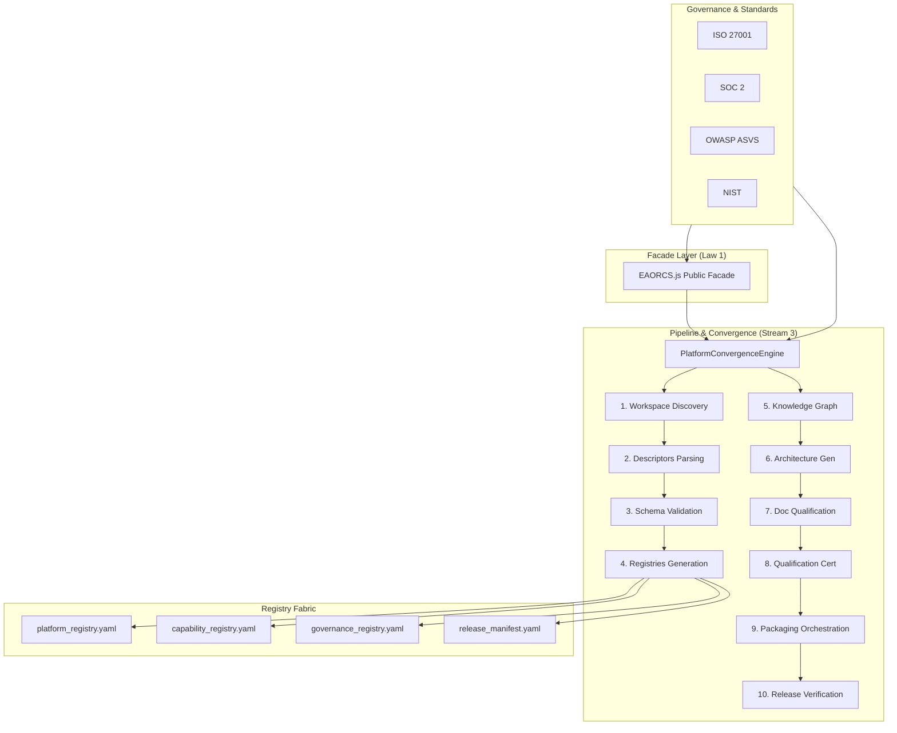

# EAORCS Platform Architecture

## Mermaid Diagram


## ASCII Representation
```text

+-----------------------------------------------------------------------------+
|          UAIGOS EAORCS Unified Platform Convergence Pipeline Architecture    |
+-----------------------------------------------------------------------------+
| [Facade]      EAORCS.js (Single Public Facade - Law 1)                     |
+-----------------------------------------------------------------------------+
| [Pipeline]    PlatformConvergenceEngine                                     |
|               1. Workspace Discovery  -->  2. Descriptors Parsing          |
|               3. Schema Validation    -->  4. Registries Generation         |
|               5. Knowledge Graph      -->  6. Architecture Generation       |
|               7. Doc Qualification    -->  8. Qualification Certification   |
|               9. Packaging Orchestr.  --> 10. Release Verification          |
+-----------------------------------------------------------------------------+
| [Registries]  - platform_registry.yaml                                      |
|               - capability_registry.yaml                                    |
|               - governance_registry.yaml                                    |
|               - release_manifest.yaml                                       |
+-----------------------------------------------------------------------------+
| [Standards]   ISO 27001 | SOC 2 | OWASP ASVS | NIST                         |
+-----------------------------------------------------------------------------+
```
