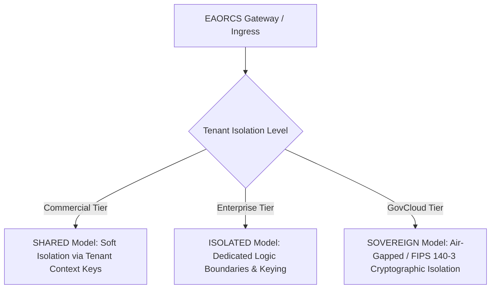

# EAORCS SaaS Product Platform Operational Guide

```txt
/******************************************************************************
 * Project        : EAORCS - Enterprise Autonomous Operation & Regulatory Compliance System
 * Module         : SaaS Product Platform Operational Guide
 * File           : docs/saas/SAAS_PLATFORM_OPERATIONS.md
 * Version        : 2026.1.0-LTS
 * Author         : Ujomor Systems Engineering & Governance Authority
 * Organization   : Ujomor Systems & Enterprise Governance
 * Created Date   : 2026-08-01
 * Last Modified  : 2026-08-01
 * Classification : GOVERNMENT | ENTERPRISE | RESTRICTED
 *
 * Governance:
 * - Security Reviewed
 * - Architecture Controlled
 * - Protocol Frozen
 * - Modularization Enforced
 *
 * Standards:
 * - ISO 27001
 * - SOC 2 Type II
 * - OWASP ASVS v4.0
 * - NIST SP 800-53 R5 / FedRAMP High
 *
 * Copyright (c) 2026 Ujomor Systems & Enterprise Governance. All Rights Reserved.
 ******************************************************************************/
```

---

## 1. Executive Summary & Governance Overview

The **EAORCS SaaS Product Platform Engine** (`engine/saas/SaaSProductPlatform.js`) provides an enterprise-grade multi-tenant SaaS architecture supporting autonomous governance, tenant organization management, tier subscription controls, feature entitlement enforcement, and strict zero-trust tenant isolation.

This document serves as the authoritative operational manual for system administrators, cloud operations, platform engineers, and governance auditors managing EAORCS multi-tenant deployments.

---

## 2. Multi-Tenant Architecture & Isolation Models

EAORCS enforces strict separation of concerns across tenant boundaries using three distinct isolation levels:



### 2.1 Isolation Level Matrix

| Isolation Level | Primary Subscription Tiers | Data Separation | Cryptographic Keying | Network Isolation |
| :--- | :--- | :--- | :--- | :--- |
| **`SHARED`** | `COMMERCIAL` | Multi-tenant shared DB with `tenant_id` partitioning | Tenant-scoped HMAC keys | Shared ingress, rate limited |
| **`ISOLATED`** | `ENTERPRISE` | Logical partition with dedicated storage schemas | Customer-Managed Encryption Keys (CMEK) | Dedicated VPC peering / private link |
| **`SOVEREIGN`** | `GOV_CLOUD` | Physical/Air-gapped dedicated cloud instances | FIPS 140-3 HSM Root Key Hierarchy | Zero-Trust air-gapped sovereign cloud |

---

## 3. Tenant Lifecycle & Onboarding Workflows

### 3.1 Lifecycle States

Tenants transition through four formal lifecycle states:

```
 [PROVISIONING] ---> [ACTIVE] <---> [SUSPENDED] ---> [DEPROVISIONED]
```

1. **`PROVISIONING`**: Initial initialization state during resource allocation.
2. **`ACTIVE`**: Fully provisioned tenant with active subscription and access to entitled features.
3. **`SUSPENDED`**: Access temporarily disabled (e.g. payment failure, compliance hold). Entitlement checks fail immediately with reason `Tenant status is SUSPENDED`.
4. **`DEPROVISIONED`**: Permanently offboarded tenant. Subscriptions are canceled and data archived/purged per retention policies.

### 3.2 Onboarding Workflow Sequence

When `SaaSProductPlatform.onboardTenant(params)` is invoked:

1. **Validation & Uniqueness Check**:
   - Ensures `name`, `code`, and `contactEmail` are present.
   - Verifies tenant `code` is unique across the global platform registry.
2. **Tenant ID Generation**:
   - Generates unique crypto-random identifier (e.g. `tnt_a1b2c3d4e5f6`).
3. **Isolation Level Assignment**:
   - Assigns isolation level based on tier (`COMMERCIAL` -> `SHARED`, `ENTERPRISE` -> `ISOLATED`, `GOV_CLOUD` -> `SOVEREIGN`).
4. **Root Organization Provisioning**:
   - Automatically provisions Root Organization (`org_<hex>`) with name `${name} Root Organization` and code `${code}-root`.
   - Attaches primary admin user profile with role `TENANT_ADMIN`.
5. **Subscription Initialization**:
   - Creates subscription record bound to tenant ID with status `ACTIVE` and selected tier.
6. **Governance Audit Logging**:
   - Appends immutable audit entry `TENANT_ONBOARDED`.

---

## 4. Organization Hierarchy & Quotas

### 4.1 Nested Organization Structure

Each tenant contains an organizational tree starting from the Root Organization. Child organizations (e.g., divisions, departments, regional offices) can be created under parent organizations within the same tenant.

```
Acme Commercial Corp (Root Org)
├── Engineering Division
│   └── DevOps & Platform Team
└── Global Sales
    └── EMEA Sub-Division
```

### 4.2 Cross-Tenant Protection Governance

EAORCS strictly enforces tenant boundaries during organization management:

> **CRITICAL SECURITY LAW**: An organization belonging to Tenant A MUST NEVER be assigned as a parent organization to an organization in Tenant B. Any attempt triggers an immediate `SEC_TENANT_VIOLATION` security exception.

### 4.3 Subscription Tier Quota Limits

| Quota Metric | `COMMERCIAL` | `ENTERPRISE` | `GOV_CLOUD` |
| :--- | :--- | :--- | :--- |
| **Max Organizations** | 5 | 50 | Unlimited (`-1`) |
| **Max Users** | 50 | 500 | Unlimited (`-1`) |
| **Max Storage (GB)** | 100 GB | 2,000 GB | Unlimited (`-1`) |
| **Rate Limit (RPM)** | 1,000 | 10,000 | 100,000 |
| **SLA Commitment** | 99.5% | 99.99% | 99.999% |

---

## 5. Subscription Tiers & Feature Entitlements

### 5.1 Subscription Tier Overview

- **`COMMERCIAL`**: Tailored for small-to-medium businesses requiring core compliance and audit capabilities.
- **`ENTERPRISE`**: Built for large enterprises requiring custom roles, DORA/NIS2/ISO27001 packs, AI Council access, and priority support.
- **`GOV_CLOUD`**: Purpose-built for defense, intelligence, and government agencies demanding FedRAMP High / StateRAMP, FIPS 140-3 cryptography, zero-trust enforcement, and sovereign air-gapped isolation.

### 5.2 Feature Entitlement Matrix

| Feature Key | Description | `COMMERCIAL` | `ENTERPRISE` | `GOV_CLOUD` |
| :--- | :--- | :---: | :---: | :---: |
| `saas.basic` | Multi-Tenant Core Platform Access | ✅ | ✅ | ✅ |
| `audit.standard` | Standard Compliance & Audit Logging | ✅ | ✅ | ✅ |
| `dsl.execution` | Policy DSL Rules Engine Execution | ✅ | ✅ | ✅ |
| `report.export` | Standard PDF/JSON Report Export | ✅ | ✅ | ✅ |
| `org.single` | Single Root Organization | ✅ | ✅ | ✅ |
| `api.access.standard` | Standard API Access Limits | ✅ | ✅ | ✅ |
| `audit.advanced` | Real-time Audit Telemetry & Forensics | ❌ | ✅ | ✅ |
| `org.hierarchy` | Multi-Level Nested Org Trees | ❌ | ✅ | ✅ |
| `rbac.custom` | Custom Role-Based Access Control | ❌ | ✅ | ✅ |
| `governance.dora_nis2` | EU DORA & NIS2 Regulatory Packs | ❌ | ✅ | ✅ |
| `compliance.iso27001_soc2` | ISO 27001 & SOC 2 Automated Evidence | ❌ | ✅ | ✅ |
| `ai.council` | Multi-Agent AI Safety Council | ❌ | ✅ | ✅ |
| `api.access.priority` | Priority API Gateway Processing | ❌ | ✅ | ✅ |
| `tenant.isolation.strict` | Dedicated Schema Isolation | ❌ | ✅ | ✅ |
| `compliance.fedramp` | FedRAMP High Security Controls | ❌ | ❌ | ✅ |
| `compliance.stateramp` | StateRAMP Moderate/High Controls | ❌ | ❌ | ✅ |
| `sovereign.airgap` | Air-Gapped Sovereign Deployment | ❌ | ❌ | ✅ |
| `zero_trust.strict` | Continuous mTLS & Zero-Trust Verification | ❌ | ❌ | ✅ |
| `crypto.fips140_3` | FIPS 140-3 Level 3 Cryptography | ❌ | ❌ | ✅ |
| `api.access.unlimited` | Unlimited Dedicated Throughput | ❌ | ❌ | ✅ |
| `unlimited.scale` | Unlimited Orgs & User Accounts | ❌ | ❌ | ✅ |

---

## 6. Operational Procedures & Integration Guide

### 6.1 Programmatic Usage in Node.js

```javascript
const { SaaSProductPlatform, SUBSCRIPTION_TIERS } = require('./engine/saas/SaaSProductPlatform');

const platform = new SaaSProductPlatform();

// 1. Onboard Tenant
const onboarding = platform.onboardTenant({
  name: 'Acme Enterprise',
  code: 'acme',
  contactEmail: 'admin@acme.com',
  tier: SUBSCRIPTION_TIERS.ENTERPRISE
});
console.log(`Tenant Onboarded: ${onboarding.tenantId}`);

// 2. Verify Feature Entitlement
const entitlement = platform.verifyEntitlement(onboarding.tenantId, 'ai.council');
if (entitlement.allowed) {
  console.log('AI Council feature granted');
}

// 3. Create Child Organization
const subOrg = platform.createOrganization(onboarding.tenantId, {
  name: 'Security Operations Center',
  parentOrgId: onboarding.rootOrganization.orgId
});

// 4. Upgrade Subscription
platform.upgradeSubscription(onboarding.tenantId, SUBSCRIPTION_TIERS.GOV_CLOUD);
```

### 6.2 Audit Log Inspection

All tenant lifecycle and administrative events generate audit trail records accessible via:

```javascript
const logs = platform.getAuditLogs(tenantId);
```

Audit events include:
- `TENANT_ONBOARDED`
- `TENANT_STATUS_UPDATED`
- `ORGANIZATION_CREATED`
- `ORG_MEMBER_ADDED`
- `SUBSCRIPTION_UPGRADED`

---

## 7. Incident Management & Emergency Operations

1. **Suspending Delinquent / Compromised Tenant**:
   Call `platform.updateTenantStatus(tenantId, 'SUSPENDED', 'Security Incident Investigation')`. All API entitlement checks will immediately deny access.
2. **Quota Exceeded Recovery**:
   When an organization or user quota is reached, upgrade the tenant's tier using `platform.upgradeSubscription(tenantId, newTier)` to automatically release additional capacity.
3. **Cross-Tenant Violation Investigation**:
   If `SEC_TENANT_VIOLATION` is caught in application logs, inspect caller context immediately to verify authorization tokens and tenant header propagation.

---

## 8. Compliance & Standard References

- **ISO/IEC 27001:2022**: Control A.5.15 (Access Control), A.8.12 (Data Leakage Prevention).
- **SOC 2 Type II**: CC6.1 (Logical Access Security), CC6.3 (Role-Based Access Management).
- **NIST SP 800-53 R5**: AC-2 (Account Management), SC-7 (Boundary Protection).
- **FedRAMP High / StateRAMP**: Multi-Tenant Isolation & Sovereign Cloud Requirements.
