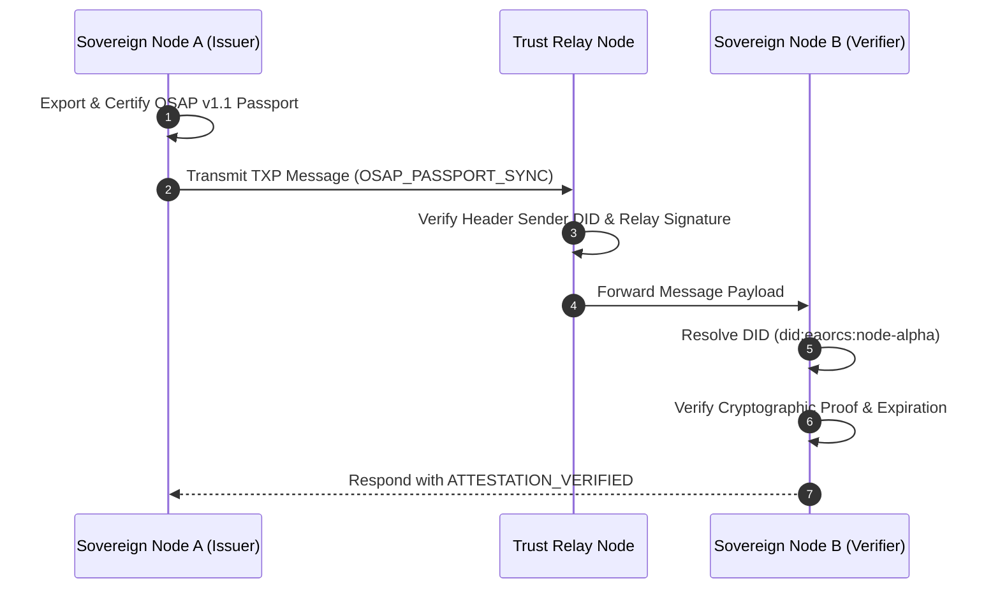

# Open Software Assurance Passport (OSAP) Protocol Version 1.1 Specification

```txt
/******************************************************************************
 * Document       : Open Software Assurance Passport (OSAP) Protocol Specification
 * Specification  : OSAP v1.1.0-FROZEN
 * Standard ID    : EAORCS-STD-OSAP-V1.1
 * Author         : Ujomor Systems Engineering & Governance Authority
 * Organization   : Ujomor Systems & Enterprise Governance
 * Effective Date : 2026-08-01
 * Last Revised   : 2026-08-01
 * Classification : GOVERNMENT | ENTERPRISE | PUBLIC STANDARD
 *
 * Governance:
 * - Security Reviewed
 * - Architecture Controlled
 * - Protocol Frozen
 * - Modularization Enforced
 * - Corporate Policy Governed
 *
 * Standards Compliance:
 * - ISO/IEC 27001:2022
 * - SOC 2 Type II
 * - OWASP ASVS v4.0.3
 * - NIST SP 800-53 Rev. 5
 * - W3C Decentralized Identifiers (DIDs) v1.0
 *
 * Copyright (c) 2026 Ujomor Systems & Enterprise Governance. All Rights Reserved.
 ******************************************************************************/
```

---

## 1. Executive Summary & Purpose

The **Open Software Assurance Passport (OSAP) Protocol Version 1.1** defines a machine-readable, cryptographically verifiable, decentralized standard for expressing, exchanging, and validating software trust, security integrity, build provenance, and regulatory compliance.

As modern software ecosystems transition toward zero-trust autonomous operations, static compliance certificates and unverified vendor attestations are no longer sufficient. OSAP v1.1 establishes a unified, sovereign identity-bound passport mechanism that packages:
1. **Software Provenance**: Precise build identity, SHA-256 binary commit hashes, and source repository origin.
2. **Assurance Classification**: Standardized operational risk and assurance tiers (`BASIC`, `STANDARD`, `HIGH`, `CRITICAL`, `LEVEL_1`–`LEVEL_5`).
3. **Governance Attestation**: Automated alignment with international enterprise security frameworks (ISO 27001, SOC 2, OWASP ASVS, NIST).
4. **Verifiable Evidence Manifests**: Cryptographic checksums and attestation statements from automated continuous integration and audit kernels.
5. **Decentralized Cryptographic Proofs**: Digital signatures bound to W3C Decentralized Identifiers (`did:eaorcs:`).

---

## 2. Architectural Principles & Sovereign Identity

### 2.1 W3C Decentralized Identifiers (`did:eaorcs:`)
OSAP v1.1 mandates that all issuing authorities, sovereign nodes, and trust relays identify themselves using W3C-compliant Decentralized Identifiers under the `did:eaorcs:` method space.

A sovereign EAORCS node identifier takes the canonical form:
```
did:eaorcs:<nodeId>
```
Example: `did:eaorcs:node-sec-alpha-01`

### 2.2 W3C DID Document Structure
Every sovereign identity node MUST publish a conforming W3C DID Document defined by `schemas/did-eaorcs-v1.schema.json`:
- **`@context`**: Array containing `"https://www.w3.org/ns/did/v1"` and `"https://eaorcs.ujomor.org/contexts/did/v1"`.
- **`verificationMethod`**: Cryptographic public key declarations (Ed25519 or RSA-4096) attached to key fragments (e.g. `did:eaorcs:node-1#key-1`).
- **`authentication` / `assertionMethod`**: References to key IDs authorized for node authentication and passport signing.
- **`service`**: Endpoints for P2P OSAP Trust Exchange (`OSAPTrustExchangeService`) and audit verification (`EAORCSAuditVerifierEndpoint`).

---

## 3. Passport Data Model & Field Specification

An OSAP v1.1 passport is expressed as a canonical JSON payload validated by `schemas/osap-v1.1.schema.json`.

```json
{
  "passportId": "osap:urn:eaorcs:passport:1785579190-a1b2c3",
  "version": "1.1",
  "issuer": "did:eaorcs:node-sec-alpha",
  "subject": {
    "softwareId": "eaorcs-governance-kernel",
    "name": "EAORCS Governance Kernel",
    "version": "2026.1.0-LTS",
    "buildHash": "a3b4c5d6e7f809123456789abcdef0123456789abcdef0123456789abcdef012",
    "repository": "d:/ujomor-platform/products/eaorcs"
  },
  "issuedAt": "2026-08-01T12:00:00.000Z",
  "expiresAt": "2026-10-30T12:00:00.000Z",
  "assuranceLevel": "CRITICAL",
  "governance": {
    "complianceStandard": ["ISO 27001", "SOC 2", "OWASP ASVS", "NIST SP 800-53"],
    "auditState": "PASSED_VERIFIED",
    "policyDigest": "0x8f3c...b12a",
    "verificationStatus": "CERTIFIED"
  },
  "evidence": [
    {
      "evidenceId": "ev-001",
      "type": "CODE_AUDIT_REPORT",
      "checksum": "e3b0c44298fc1c149afbf4c8996fb92427ae41e4649b934ca495991b7852b855",
      "timestamp": "2026-08-01T12:00:00.000Z",
      "attestation": "Passed static security analysis and zero-vulnerability check"
    }
  ],
  "proof": {
    "type": "EaorcsHmacSha256",
    "created": "2026-08-01T12:00:00.000Z",
    "verificationMethod": "did:eaorcs:node-sec-alpha#key-1",
    "proofPurpose": "assertionMethod",
    "proofValue": "9f8e7d6c5b4a3210..."
  },
  "trustExchange": {
    "protocolVersion": "1.1",
    "relayNode": "did:eaorcs:trust-relay-01",
    "signature": "a1b2c3d4e5f6..."
  }
}
```

### 3.1 Field Requirements Table
| Field | Type | Description | Mandatory |
| :--- | :--- | :--- | :--- |
| `passportId` | `string` | URN identifier matching `osap:urn:eaorcs:passport:*` | YES |
| `version` | `string` | Must be explicitly `"1.1"` | YES |
| `issuer` | `string` | W3C DID of issuer (`did:eaorcs:<nodeId>`) | YES |
| `subject` | `object` | Software metadata (softwareId, name, version, buildHash) | YES |
| `issuedAt` | `ISO-8601` | Timestamp of passport issuance | YES |
| `expiresAt` | `ISO-8601` | Expiration timestamp (maximum 90 days) | YES |
| `assuranceLevel` | `enum` | `BASIC`, `STANDARD`, `HIGH`, `CRITICAL`, `LEVEL_1`–`5` | YES |
| `governance` | `object` | Compliance standards, audit verdict, policy digest | YES |
| `evidence` | `array` | Attestation artifacts with SHA-256 checksums | YES |
| `proof` | `object` | Cryptographic signature proof and verification key URL | YES |
| `trustExchange` | `object` | Decentralized routing metadata and relay signature | NO |

---

## 4. Decentralized Trust Exchange Protocol

To support peer-to-peer verification across enterprise multi-cloud nodes, OSAP v1.1 specifies the **Trust Exchange Protocol (TXP-1.1)**.

### 4.1 Message Envelope Structure
Trust Exchange messages encapsulate passports or attestation queries during node-to-node synchronization:

```json
{
  "header": {
    "messageId": "msg-tx-8801",
    "protocolVersion": "1.1",
    "senderDid": "did:eaorcs:node-alpha",
    "recipientDid": "did:eaorcs:node-beta",
    "timestamp": "2026-08-01T12:05:00.000Z",
    "messageType": "OSAP_PASSPORT_SYNC"
  },
  "payload": {
    "passportId": "osap:urn:eaorcs:passport:1785579190-a1b2c3",
    "status": "VERIFIED"
  },
  "signature": "56a26e4073ee2ac7b747f35297d3b5c736131fbe..."
}
```

### 4.2 Synchronization & Handshake Workflow


---

## 5. Verification & Certification Life-Cycle

### 5.1 Verification Algorithm
When a node receives an OSAP v1.1 passport, `OSAPSpecificationEngine.validateOSAPPassport` executes the following sequence:
1. **Schema Integrity**: Validate JSON fields against `schemas/osap-v1.1.schema.json`.
2. **Version Pinning**: Confirm `version === "1.1"`.
3. **DID Format Check**: Validate issuer matches `^did:eaorcs:[a-zA-Z0-9._-]+$`.
4. **Temporal Bounds**: Check `issuedAt <= currentTime` and `expiresAt > currentTime`.
5. **Assurance Validation**: Verify `assuranceLevel` belongs to approved tier enums.
6. **Governance Completeness**: Ensure `complianceStandard` lists mandatory frameworks and `auditState` indicates verified compliance.
7. **Cryptographic Validation**: Re-compute canonical payload digest and verify signature proof.

### 5.2 Passport Certification
Certified passports are augmented with a `certification` block containing a unique `certificateId` (e.g. `CERT-OSAP-...`), verification timestamp, governing authority string, and cryptographic signature digest.

---

## 6. Security, Cryptography & Compliance Governance

### 6.1 Cryptographic Standards Alignment
OSAP v1.1 enforces strict cryptographic standards:
- **Hashing**: SHA-256 (`crypto.createHash('sha256')`) for binary build hashes, evidence checksums, policy digests, and payload normalization.
- **Asymmetric Signatures**: Ed25519 (`Ed25519VerificationKey2020`) for W3C DID keypairs and assertion methods.
- **Symmetric Proofs**: HMAC-SHA256 (`EaorcsHmacSha256`) for lightweight inter-node message signing.

### 6.2 Regulatory Compliance Mapping
| Framework | Section | OSAP v1.1 Implementation |
| :--- | :--- | :--- |
| **ISO 27001** | A.8.28 (Secure Coding) | Automated software build hash attestation and static analysis evidence. |
| **SOC 2** | CC6.1, CC6.6 | Sovereign DID node identity authentication and cryptographically signed audit logs. |
| **OWASP ASVS** | V14 (Configuration) | Mandatory governance policy digest and protocol version freeze enforcement. |
| **NIST SP 800-53** | SA-11 (Developer Testing) | Continuous integration evidence manifests attached to OSAP passports. |

---

## 7. Conformance Matrix & Reference Implementation

The reference engine implementation and formal schemas for OSAP v1.1 are hosted within the EAORCS core repository:

1. **Engine Specification**: `engine/spec/OSAPSpecificationEngine.js`
2. **OSAP v1.1 JSON Schema**: `schemas/osap-v1.1.schema.json`
3. **W3C DID Document Schema**: `schemas/did-eaorcs-v1.schema.json`
4. **Conformance Test Suite**: `tests/phase9/stream_d_standards_conformance.test.js`

All conforming implementations MUST pass 100% of the assertions defined in `stream_d_standards_conformance.test.js`.
